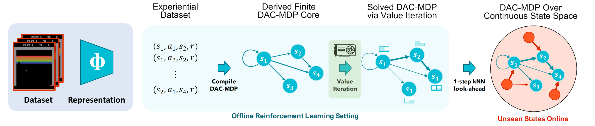

# 

Code accompanying the paper:
"[DeepAveragers: Offline Reinforcement Learning by Solving Derived Non-Parametric MDPs](https://idigitopia.github.io/projects/dac/)" \



### Installation

```
pip install -r requirements.txt
pip instlal -e . 
```
